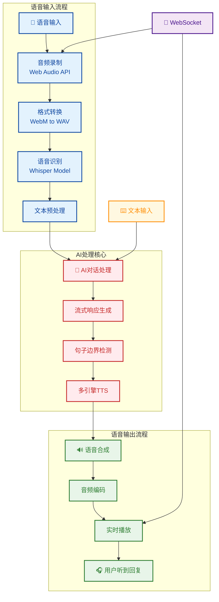

# AI语音聊天系统 (AI Chat Voice)

[](https://github.com/your-username/ai-chat-voice)
[](https://www.python.org/)
[](https://fastapi.tiangolo.com/)
[](LICENSE)

一个基于 FastAPI + WebSocket + Whisper 的智能语音聊天系统，支持文本和语音两种交互模式，集成AI大语言模型进行智能对话。

https://github.com/user-attachments/assets/03ef1b47-d256-4d9b-b2a2-aa9f34e83781

## 🌟 功能特性

### 🎙️ 语音交互
- **实时语音识别**: 使用 Whisper 模型进行高精度语音转文字
- **多引擎TTS**: 支持多种文本转语音引擎（gTTS、EdgeTTS、pyttsx3、ElevenLabs）
- **语音活动检测**: 智能检测语音输入和静音
- **音频格式转换**: 自动处理 WebM 到 WAV 格式转换
- **流式语音播放**: 实时播放AI语音回复

### 💬 文本对话
- **智能AI对话**: 集成 DeepSeek 等大语言模型，提供智能回复
- **流式响应**: AI回复支持流式输出，提升用户体验
- **句子级处理**: 按句子边界智能分割，实现更自然的语音交互
- **多语言支持**: 支持中文和英文对话
- **上下文记忆**: 自动维护对话历史，支持多轮对话

### 🔌 实时通信
- **WebSocket实时通信**: 基于WebSocket实现低延迟的实时对话
- **双模式交互**: 支持文本聊天和语音聊天两种模式
- **连接管理**: 智能管理WebSocket连接状态
- **错误恢复**: 自动重连和错误处理机制

### 🎨 用户界面
- **响应式设计**: 现代化Web界面，支持移动端适配
- **双标签页界面**: 文本聊天和语音聊天独立标签
- **实时状态指示**: 连接状态和语音活动检测
- **语音波形显示**: 实时显示语音输入波形
- **消息时间戳**: 显示消息发送时间

## 🛠️ 技术栈

### 后端技术
- **FastAPI**: 高性能 Python Web 框架
- **WebSocket**: 实时双向通信
- **Whisper**: OpenAI 语音识别模型
- **gTTS/EdgeTTS/pyttsx3**: 文本转语音引擎
- **ElevenLabs**: 高级语音合成服务
- **Pydub**: 音频处理库
- **SQLite**: 轻量级数据存储

### 前端技术
- **HTML5 + CSS3**: 现代化响应式界面
- **JavaScript ES6+**: 交互逻辑实现
- **WebSocket API**: 实时通信
- **Web Audio API**: 音频录制和播放
- **Font Awesome**: 图标库

### AI 集成
- **DeepSeek API**: 大语言模型服务
- **Whisper模型**: 语音识别（支持多种尺寸）
- **多TTS引擎**: 灵活的语音合成方案

## 📦 安装部署

### 环境要求
- Python 3.8+
- pip 20.0+
- 支持的操作系统：Windows、Linux、macOS

### 1. 克隆项目
```bash
git clone https://github.com/Anthonybuer182/ai-chat-voice.git
cd ai-chat-voice
```

### 2. 安装依赖
```bash
pip install -r requirements.txt
```

### 3. 配置环境变量
创建 `.env` 文件并设置 API 密钥：
```bash
API_KEY=your-deepseek-api-key-here
MODEL=deepseek-chat
API_BASE=https://api.deepseek.com/v1
WHISPER_MODEL=base
ELEVENLABS_API_KEY=your-elevenlabs-api-key-here
```

> **注意**: 项目使用 DeepSeek API，需要注册并获取 API 密钥
> 
> **获取 API 密钥**: 访问 [DeepSeek 平台](https://platform.deepseek.com/) 注册账号并获取 API 密钥

### 4. 启动应用
```bash
python main.py
```

应用将在 `http://localhost:8000` 启动，访问该地址即可使用。


## 🚀 使用指南

### 文本聊天模式
1. 点击"文本聊天"标签页
2. 在输入框中输入问题
3. 点击发送按钮或按 Enter 键
4. 查看AI的实时流式回复

### 语音聊天模式
1. 点击"语音聊天"标签页
2. 点击麦克风按钮开始录音
3. 说话后松开按钮结束录音
4. 系统自动识别语音并获取AI回复
5. 回复内容将通过语音播放

### 高级功能
- **语言切换**: 支持中英文切换
- **TTS引擎选择**: 可根据需求选择不同的语音合成引擎
- **历史记录**: 对话历史自动保存，支持多会话管理

## 📁 项目结构

### 目录结构
```
ai-chat-voice/
├── main.py                 # 主应用文件
├── index.html             # 前端界面文件
├── requirements.txt       # 依赖包列表
├── README.md             # 项目说明文档
├── .env                  # 环境配置文件（需手动创建）
├── LICENSE               # 许可证文件
└── static/
    └── favicon.ico       # 网站图标
```

### 系统架构图


## 🔧 核心模块

### 后端模块
- **Config**: 配置管理类，管理API密钥和系统参数
- **ConnectionManager**: WebSocket连接管理器，支持多频道连接
- **ChatHistory**: 聊天历史管理，支持会话隔离和长度限制
- **AudioProcessor**: 音频处理工具，支持Base64编码和格式转换
- **AIService**: AI服务核心，集成聊天和TTS功能
- **SentenceProcessor**: 句子处理器，实现智能分割和边界检测

### 前端功能
- **双标签页界面**: 文本聊天和语音聊天独立标签
- **实时消息显示**: 支持流式消息和语音播放
- **语音录制**: 基于Web Audio API的录音功能
- **状态指示器**: 连接状态和语音活动检测
- **响应式设计**: 适配不同屏幕尺寸

## ⚙️ 配置说明

### API配置
项目支持多种AI服务提供商，默认使用DeepSeek API：
- `API_KEY`: API访问密钥
- `MODEL`: 使用的模型名称（默认：deepseek-chat）
- `API_BASE`: API基础URL（默认：https://api.deepseek.com/v1）
- `WHISPER_MODEL`: 语音识别模型大小（tiny/base/small/medium/large）
- `ELEVENLABS_API_KEY`: ElevenLabs API密钥（用于高级TTS服务）


### TTS引擎配置
支持多种TTS引擎，可通过前端界面选择：
- **gTTS**: Google Text-to-Speech（在线，质量好）
- **EdgeTTS**: Microsoft Edge TTS（在线，支持多种语音）
- **pyttsx3**: 离线TTS引擎（无需网络，响应快）
- **ElevenLabs**: 高级语音合成服务（需配置API密钥）


### 性能配置
- **流式响应**: 启用实时流式AI回复
- **句子分割**: 按标点符号智能分割句子
- **历史长度**: 每个会话最大50条历史记录
- **音频采样率**: 16000Hz 标准采样率

## 🛠️ 开发指南

### 添加新功能
1. 在 `main.py` 中添加新的 API 端点或模块
2. 在前端 `index.html` 中添加相应界面元素
3. 更新文档和测试

### 自定义模型
修改 `main.py` 中的模型配置：
```python
# 更换语音识别模型
whisper_model = WhisperModel('large', device="cpu", compute_type="int8")

# 更换 TTS 引擎
async def text_to_speech_with_engine(text, engine='edgetts'):
    # 实现自定义 TTS 调用

# 更换 LLM 服务
client = AsyncOpenAI(
    api_key='your-api-key',
    base_url='your-api-base-url'
)
```

### 扩展开发
可以轻松扩展以下功能：
- 添加新的AI服务提供商
- 集成更多TTS引擎
- 支持更多语言
- 添加插件系统
- 实现用户认证
- 添加文件上传功能

## 📄 许可证

本项目基于 MIT 许可证 - 查看 [LICENSE](LICENSE) 文件了解详情

## 🤝 贡献指南

1. Fork 项目
2. 创建特性分支 (`git checkout -b feature/AmazingFeature`)
3. 提交更改 (`git commit -m 'Add some AmazingFeature'`)
4. 推送到分支 (`git push origin feature/AmazingFeature`)
5. 开启 Pull Request

## 🙏 致谢

- [FastAPI](https://fastapi.tiangolo.com/) - 优秀的 Python Web 框架
- [Whisper](https://github.com/openai/whisper) - OpenAI 语音识别模型
- [DeepSeek](https://platform.deepseek.com/) - 大语言模型服务
- [gTTS](https://gtts.readthedocs.io/) - Google 文本转语音
- [Font Awesome](https://fontawesome.com/) - 图标库

## 📞 支持

如有问题或建议，请通过以下方式联系：

- 提交 GitHub Issue
- 发送邮件至项目维护者

## 🎯 路线图

- [ ] 支持更多语音识别引擎
- [ ] 集成本地LLM模型
- [ ] 添加用户认证系统
- [ ] 支持文件上传和文档对话
- [ ] 实现多用户聊天室
- [ ] 添加语音克隆功能
- [ ] 支持更多语言界面

---

**注意**: 使用前请确保已配置正确的 API 密钥，并遵守相关服务的使用条款。

**恳求**: ❤️喜欢ai-chat-voice这个项目？那就给它星星🌟吧

**享受与AI的智能对话体验！** 🎉
