# AI Chat Voice System

[](https://github.com/your-username/ai-chat-voice)
[](https://www.python.org/)
[](https://fastapi.tiangolo.com/)
[](LICENSE)

<div align="center">
  <p>
    <a href="README.md">中文</a> | <strong>English</strong>
  </p>
</div>

An intelligent voice chat system based on FastAPI + WebSocket + STT + LLM + TTS, supporting both text and voice interaction modes, integrated with AI large language models for intelligent conversations.

https://github.com/user-attachments/assets/03ef1b47-d256-4d9b-b2a2-aa9f34e83781

## 🌟 Features

### 🎙️ Voice Interaction
- **Real-time Speech Recognition**: High-precision speech-to-text using Faster-Whisper model
- **Multi-engine TTS**: Support for various text-to-speech engines (gTTS, EdgeTTS, pyttsx3, ElevenLabs)
- **Voice Activity Detection**: Intelligent detection of voice input and silence
- **Audio Format Conversion**: Automatic WebM to WAV format conversion
- **Streaming Voice Playback**: Real-time AI voice response playback

### 💬 Text Conversation
- **Intelligent AI Dialogue**: Integrated with LLM and other large language models for smart responses
- **Streaming Response**: AI responses support streaming output for better user experience
- **Sentence-level Processing**: Intelligent segmentation by sentence boundaries for more natural voice interaction
- **Multi-language Support**: Support for Chinese and English conversations
- **Context Memory**: Automatic conversation history maintenance with multi-turn dialogue support

### 🔌 Real-time Communication
- **WebSocket Real-time Communication**: Low-latency real-time dialogue based on WebSocket
- **Dual-mode Interaction**: Support for both text chat and voice chat modes
- **Connection Management**: Intelligent WebSocket connection state management
- **Error Recovery**: Automatic reconnection and error handling mechanisms

### 🎨 User Interface
- **Responsive Design**: Modern web interface with mobile device adaptation
- **Dual Tab Interface**: Independent tabs for text chat and voice chat
- **Real-time Status Indicators**: Connection status and voice activity detection
- **Voice Waveform Display**: Real-time voice input waveform visualization
- **Message Timestamps**: Display message sending times

## 🛠️ Technology Stack

### Backend Technology
- **FastAPI**: High-performance Python web framework
- **WebSocket**: Real-time bidirectional communication
- **Faster-Whisper**: OpenAI speech recognition model (supports multiple sizes)
- **gTTS/EdgeTTS/pyttsx3/ElevenLabs**: Text-to-speech engines
- **Pydub**: Audio processing library

### Frontend Technology
- **HTML5 + CSS3**: Modern responsive interface
- **JavaScript ES6+**: Interaction logic implementation
- **WebSocket API**: Real-time communication
- **Web Audio API**: Audio recording and playback
- **Font Awesome**: Icon library

### AI Integration
- **LLM API**: Large language model service
- **Faster-Whisper Model**: Speech recognition (supports multiple sizes)
- **Multi-TTS Engines**: Flexible speech synthesis solutions

## 📦 Installation & Deployment

### Environment Requirements
- Python 3.8+
- pip 20.0+
- Supported OS: Windows, Linux, macOS

### 1. Clone the Project
```bash
git clone https://github.com/Anthonybuer182/ai-chat-voice.git
cd ai-chat-voice
```

### 2. Create Virtual Environment

**macOS / Linux:**
```bash
# Create virtual environment
python3 -m venv venv

# Activate virtual environment
source venv/bin/activate
```

**Windows:**
```bash
# Create virtual environment
python3 -m venv venv

# Activate virtual environment
venv\Scripts\activate
```

### 3. Install Dependencies
```bash
pip3 install -r requirements.txt
```

### 4. Configure Environment Variables
Create `.env` file and set API keys:
```bash
API_KEY=your-llm-api-key-here
MODEL=llm-model-name-here
API_BASE=llm-api-base-url-here
WHISPER_MODEL=base
ELEVENLABS_API_KEY=your-elevenlabs-api-key-here
```

> **Note**: If using DeepSeek API and ElevenLabs API, you need to register and obtain corresponding API keys
> 
> **Get DeepSeek API Key**: Visit [DeepSeek Platform](https://platform.deepseek.com/) to register and get API key
> 
> **Get ElevenLabs API Key**: Visit [ElevenLabs Website](https://elevenlabs.io/) to register and get API key

### 5. Start the Application
```bash
python main.py
```

The application will start at `http://localhost:8000`, visit this address to use it.

## 🚀 Usage Guide

### Text Chat Mode
1. Click "Text Chat" tab
2. Enter your question in the input box
3. Click send button or press Enter key
4. View AI's real-time streaming response

### Voice Chat Mode
1. Click "Voice Chat" tab
2. Click microphone button to start recording
3. Speak and release button to end recording
4. System automatically recognizes speech and gets AI response
5. Response content will be played through voice

### Advanced Features
- **Language Switching**: Support Chinese and English switching
- **TTS Engine Selection**: Choose different speech synthesis engines based on needs
- **History Records**: Conversation history automatically saved with multi-session management

### 🌐 Documentation Language Switching
The project provides bilingual documentation in both Chinese and English for developers speaking different languages:
- **Chinese Documentation**: [README.md](README.md) - 中文文档
- **English Documentation**: [README_EN.md](README_EN.md) - Current document

Language switching links are available at the top of the GitHub page, allowing you to switch between Chinese and English documentation.

## 📁 Project Structure

### Directory Structure
```
ai-chat-voice/
├── main.py                 # Main application file
├── index.html             # Frontend interface file
├── requirements.txt       # Dependency package list
├── README.md             # Project documentation (Chinese)
├── README_EN.md          # Project documentation (English)
├── .env                  # Environment configuration file (need to create manually)
├── LICENSE               # License file
└── static/
    └── favicon.ico       # Website icon
```

### System Architecture Diagram

```mermaid
graph LR
    %% User Layer
    User["User"]
    
    %% Frontend Layer
    subgraph "Frontend Layer"
        WebUI["Web Interface"]
        InputText["Input Text"]
        ManualRecord["Manual Voice Recording"]
        AutoDetect["VAD Auto Voice Detection"]
    end
    
    %% Backend Layer
    subgraph "Backend Layer"
        WebSocket["WebSocket Service"]
        ChatService["Chat Service"]
        Text["Text"]
        Audio["Audio"]
        LLM["Large Language Model<br/>LLM"]
        TTS["Text-to-Speech<br/>TTS"]
        ASR["Speech Recognition<br/>Faster-Whisper"]
    end
    
    %% Data Flow
    User --> WebUI
    WebUI --> InputText["Input Text"]
    WebUI --> ManualRecord["Manual Voice Recording"]
    WebUI --> AutoDetect["VAD Auto Voice Detection"]
    InputText --> WebSocket
    ManualRecord --> WebSocket
    AutoDetect --> WebSocket
    WebSocket --> Text
    Text --> ChatService
    WebSocket --> Audio
    Audio --> ASR
    ASR --> ChatService
    ChatService --> LLM
    LLM --> TTS

    
    %% Style Definitions
    classDef user fill:#e3f2fd,stroke:#1976d2,stroke-width:2px,color:#000000,font-weight:bold
    classDef frontend fill:#f3e5f5,stroke:#7b1fa2,stroke-width:2px,color:#000000,font-weight:bold
    classDef backend fill:#e8f5e8,stroke:#2e7d32,stroke-width:2px,color:#000000,font-weight:bold
    classDef ai fill:#fff3e0,stroke:#f57c00,stroke-width:2px,color:#000000,font-weight:bold
    classDef input fill:#e1f5fe,stroke:#0288d1,stroke-width:2px,color:#000000,font-weight:bold
    
    class User user
    class WebUI frontend
    class WebServer,WebSocket,ChatService,Audio backend
    class Text backend
    class LLM,TTS,ASR ai
    class InputText,ManualRecord,AutoDetect input
```


## 🔧 Core Modules

### Backend Modules
- **Config**: Configuration management class for API keys and system parameters
- **ConnectionManager**: WebSocket connection manager with multi-channel support
- **ChatHistory**: Chat history management with session isolation and length limits
- **AudioProcessor**: Audio processing tools with Base64 encoding and format conversion
- **AIService**: AI service core integrating chat and TTS functionality
- **SentenceProcessor**: Sentence processor with intelligent segmentation and boundary detection

### Frontend Features
- **Dual Tab Interface**: Independent tabs for text chat and voice chat
- **Real-time Message Display**: Support for streaming messages and voice playback
- **Voice Recording**: Web Audio API-based recording functionality
- **Status Indicators**: Connection status and voice activity detection
- **Responsive Design**: Adaptation to different screen sizes

## ⚙️ Configuration

### API Configuration
Project supports multiple AI service providers, compatible with OpenAI-SDK:
- `API_KEY`: API access key
- `MODEL`: Model name to use (recommended: deepseek-chat)
- `API_BASE`: API base URL (recommended: https://api.deepseek.com/v1)
- `WHISPER_MODEL`: Speech recognition model size (tiny/base/small/medium/large)
- `ELEVENLABS_API_KEY`: ElevenLabs API key (for premium TTS service)

### TTS Engine Configuration
Support for multiple TTS engines, selectable through frontend interface:
- **gTTS**: Google Text-to-Speech (online, good quality)
- **EdgeTTS**: Microsoft Edge TTS (online, supports multiple voices)
- **pyttsx3**: Offline TTS engine (no network required, fast response)
- **ElevenLabs**: Premium speech synthesis service (requires API key)

#### TTS Engine Comparison Table

| Feature | pyttsx3 | gTTS | EdgeTTS | ElevenLabs |
|---------|---------|------|---------|------------|
| **Network Dependency** | ❌ Offline | ✅ Online | ✅ Online | ✅ Online |
| **Response Speed** | ⚡ Very Fast | 🐢 Slow | 🐢 Slow | 🐢 Slow |
| **Voice Quality** | ⭐⭐ Average | ⭐⭐⭐ Good | ⭐⭐⭐⭐ Very Good | ⭐⭐⭐⭐⭐ Excellent |
| **Naturalness** | ⭐⭐ Robotic | ⭐⭐⭐ Fairly Natural | ⭐⭐⭐⭐ Natural | ⭐⭐⭐⭐⭐ Very Natural |
| **Multi-language Support** | ⭐⭐ Limited | ⭐⭐⭐⭐ Rich | ⭐⭐⭐⭐⭐ Very Rich | ⭐⭐⭐⭐⭐ Very Rich |
| **Voice Selection** | ⭐ Few | ⭐⭐⭐ Many | ⭐⭐⭐⭐⭐ Very Many | ⭐⭐⭐⭐⭐ Very Many |
| **API Key Required** | ❌ Not Required | ❌ Not Required | ❌ Not Required | ✅ Required |
| **Cost** | 💰 Free | 💰 Free | 💰 Free | 💰 Paid |
| **Stability** | ⭐⭐⭐⭐ Stable | ⭐⭐⭐ Average | ⭐⭐⭐ Average | ⭐⭐⭐⭐ Stable |
| **Recommended Use** | Offline Apps<br>Fast Response | General Quality<br>Free Usage | Multi-language<br>High Quality | Commercial Apps<br>Premium Quality |

### Performance Configuration
- **Streaming Response**: Enable real-time streaming AI responses
- **Sentence Segmentation**: Intelligent segmentation by punctuation
- **History Length**: Maximum 50 records per session
- **Audio Sample Rate**: 16000Hz standard sample rate

## 🛠️ Development Guide

### Adding New Features
1. Add new API endpoints or modules in `main.py`
2. Add corresponding interface elements in frontend `index.html`
3. Update documentation and tests

### Customizing Models
Modify model configuration in `main.py`:
```python
# Change speech recognition model
whisper_model = WhisperModel('large', device="cpu", compute_type="int8")

# Change TTS engine
async def text_to_speech_with_engine(text, engine='edgetts'):
    # Implement custom TTS call

# Change LLM service
client = AsyncOpenAI(
    api_key='your-api-key',
    base_url='your-api-base-url'
)
```

### Extension Development
Easily extend the following features:
- Add new AI service providers
- Integrate more TTS engines
- Support more languages
- Add plugin system
- Implement user authentication
- Add file upload functionality

## 📄 License

This project is licensed under the MIT License - see the [LICENSE](LICENSE) file for details

## 🤝 Contributing

1. Fork the project
2. Create feature branch (`git checkout -b feature/AmazingFeature`)
3. Commit changes (`git commit -m 'Add some AmazingFeature'`)
4. Push to branch (`git push origin feature/AmazingFeature`)
5. Open Pull Request

## 🙏 Acknowledgments

- [FastAPI](https://fastapi.tiangolo.com/) - Excellent Python web framework
- [Faster-Whisper](https://github.com/SYSTRAN/faster-whisper) - OpenAI speech recognition model (supports multiple sizes)
- [gTTS](https://gtts.readthedocs.io/) - Google Text-to-Speech
- [Font Awesome](https://fontawesome.com/) - Icon library

## 📞 Support

For questions or suggestions, please contact via:

- Submit [GitHub Issue](https://github.com/Anthonybuer182/ai-chat-voice/issues)
- Email the project maintainer

## 🎯 Roadmap

- [ ] Support more speech recognition engines
- [ ] Integrate local LLM models
- [ ] Add user authentication system
- [ ] Support file upload and document conversation
- [ ] Implement multi-user chat rooms
- [ ] Add voice cloning functionality
- [ ] Support more language interfaces

---

**Note**: Please ensure correct API keys are configured before use, and comply with relevant service terms of use.

**Request**: ❤️ Like the ai-chat-voice project? Give it a star 🌟

**Enjoy intelligent conversations with AI!** 🎉